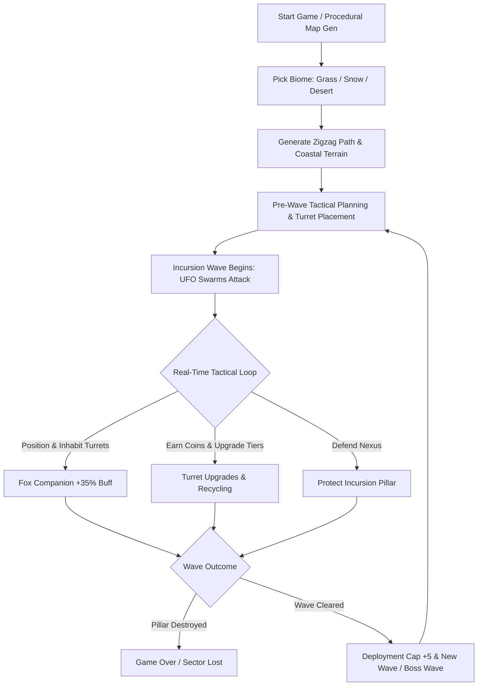
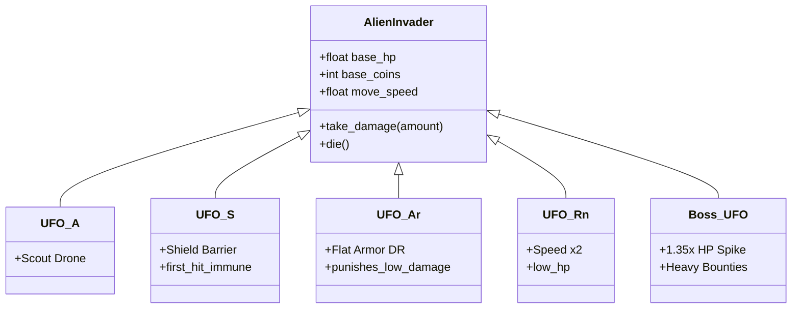
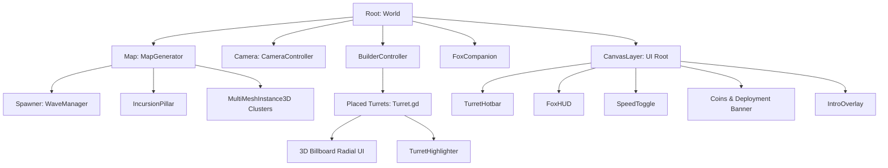
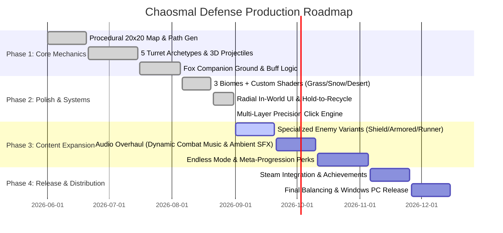

# Executive Summary — Chaosmal Defense

> **Document Type:** Game Design Document (GDD) — Developer-Focused Executive Summary & Design Bible  
> **Game Title:** Chaosmal Defense  
> **Engine & Version:** Godot Engine 4.x (Forward+ Rendering, Physics Interpolation)  
> **Target Platform:** PC (Windows)  
> **Genre:** 3D Procedural Tower Defense / Real-Time Tactical Strategy  
> **Target Audience:** Strategy & Tower Defense enthusiasts, mid-core PC gamers, fans of tactical positioning and procedural progression (e.g., *Kingdom Rush*, *Bad North*, *Bloons TD 6*, *Defense Grid*).  
> **Document Status:** Active Reference & Production Baseline  

---

## 1. High Concept & Elevator Pitch

**Chaosmal Defense** is a fast-paced, stylized 3D procedural tower defense game that blends grid-based strategic placement with real-time tactical companion control. Players command the defense of the sector's **Incursion Pillar** against relentless waves of invading alien UFOs traversing procedurally generated zigzag pathways across dynamic planetary biomes. 

Unlike traditional static tower defense titles, players deploy the **Tactical Advisor Fox** directly onto the battlefield — an active, movable ground companion that can be commanded in real-time to inhabit any turret on the frontlines, infusing it with **+35% Firepower and Attack Speed buffs**. Combining modular turret archetypes, procedural island terrain generation, adaptive enemy resistances, and intense boss waves, *Chaosmal Defense* delivers high-stakes tactical decision-making in every run.



---

## 2. Core Game Pillars

1. **Active Tactical Leadership (The Fox Protocol):**  
   Strategy isn't just about pre-wave build orders. The player has a tangible presence on the map through the *Fox Companion*, allowing on-the-fly tactical triage, dynamic lane reinforcement, and instant firepower amplification where enemies threaten to break through.
2. **Procedural Variety & Environmental Adaptation:**  
   No two battlefields are identical. Every match dynamically constructs a unique 20x20 island featuring guaranteed non-overlapping half-step zigzag enemy paths, procedural coastal cliff geometry, and one of three distinct biomes (Grassland, Alpine Snow, Arid Desert) complete with biome-specific wind and atmospheric shaders.
3. **Deep Archetypal Arsenal with Economic Agility:**  
   Five distinct defensive weapon classes (Kinetic Turret, Heavy Turret, Explosive Cannon, High-Velocity Ballista, and Deadzone Catapult) each feature 5 upgrade tiers with distinct visual transformations. An integrated refund system and a high-tier hold-to-confirm recycling safeguard enable strategic layout adaptations during prolonged incursion sieges.
4. **Escalating Threat Profiles & Strategic Counters:**  
   Enemy swarms are not merely larger health sponges; distinct alien variants (Shielded, Armored, Runner, Regenerator, and Heavy Dreadnoughts) directly counter one-dimensional turret setups and demand diverse weapon synergies, peaking every 5 waves in punishing Boss encounters.

---

## 3. Core Gameplay Loop

```mermaid
flowchart LR
    subgraph Economy & Planning
        P1[Examine Procedural Path] --> P2[Spend Coins from Hotbar]
        P2 --> P3[Deploy 1x1 & 2x2 Turrets]
    end
    
    subgraph Combat & Tactical Action
        C1[Wave Incursion Starts] --> C2[Turrets Auto-Engage Target]
        C2 --> C3[Command Fox Companion into Chokepoint Turret]
        C3 --> C4[Destroy Invaders & Collect Bounties]
    end
    
    subgraph Progression & Escalation
        U1[Upgrade Key Turrets Lvl 1-5] --> U2[Survive Boss Wave every 5 Waves]
        U2 --> U3[Deployment Limit Increases +5]
    end
    
    Economy & Planning --> Combat & Tactical Action
    Combat & Tactical Action --> Progression & Escalation
    Progression & Escalation --> Economy & Planning
```

### Minute-to-Minute Player Flow
1. **Survey & Plan:** Survey the procedural route, examine choke points and corner positions, and place initial turrets from the intuitive bottom hotbar.
2. **Engage & Adapt:** Alien UFO waves spawn from the spawner monolith and navigate toward the Incursion Pillar. Turrets fire automatically based on range and weapon-specific constraints (e.g. half-circle arcs, minimum deadzones).
3. **Tactical Micro:** The player selects the Fox (hotkey `[F]` or click) and commands it into specific turrets to provide instant +35% combat buffs to counter unexpected enemy rushes or armored targets.
4. **Economic Investment:** Earn bounty coins from eliminated invaders. Invest in single-turret upgrade branches or expand defensive footprint across newly unlocked deployment limits.
5. **Boss Wave Defense:** Every 5th wave triggers a high-density Boss Incursion with scaled health pools and specialized escort units.

---

## 4. Systems & Mechanics Breakdown

### 4.1. Tactical Hero Companion (Fox Companion)
- **Deployment:** Automatically drops into the combat zone via bouncy drop animation and poof particle effect at session start.
- **Selection & Commands:** Can be toggled via hotkey `[F]`, left tactical HUD widget, or direct click. Right-clicking or issuing commands moves the Fox to snapped grid tiles or directly enters a targeted turret.
- **Turret Buffing:** While inhabiting a turret, grants **+35% Firepower & Attack Speed**, accompanied by an animated golden hero badge, particle flare, and enhanced projectile output.
- **Dynamic Repositioning:** Can hop between turrets seamlessly or eject onto open ground during combat without penalties.

### 4.2. Defensive Arsenal & Footprint Management

| Turret Archetype | Footprint | Weapon Type | Attack Range | Min Range | AoE Splash | Core Tactical Role |
|:---|:---:|:---|:---:|:---:|:---:|:---|
| **Standard Turret** | 1x1 | Rapid Kinetic | 1.5 - 2.5 tiles | 0.0 | No | Fast single-target suppression, low cost, early wave defense. |
| **Heavy Turret** | 2x2 | Heavy Kinetic | 2.5 - 4.0 tiles | 0.0 | No | Massive single-target punch, high durability against armored foes. |
| **Cannon** | 1x1 | Explosive Shell | 2.0 - 3.2 tiles | 0.0 | Yes (2.0 - 3.5m) | Dense cluster and swarm control, splash damage. |
| **Ballista** | 1x1 | Piercing Arrow | 3.5 - 5.5 tiles | 0.0 | No | Long-range sniper, rapid target elimination along straight corridors. |
| **Catapult** | 1x1 | Heavy Boulder | 4.0 - 6.5 tiles | 3.0 tiles | Yes (3.0 - 5.0m) | Long-range artillery with deadzone; wipes out clustered runner swarms. |

### 4.3. Turret Upgrades & Hold-to-Recycle
- **5-Tier Progression:** Each upgrade level increases damage (+45%/lvl), attack range, and firing speed while scaling upgrade costs (+55%/lvl).
- **In-World 3D Radial UI:** Dynamic billboards anchored over turrets provide one-click level inspection, cost preview, and upgrade execution.
- **Economic Safety & Recycling:**
  - Levels 1–4 can be instantly sold for full/partial currency recovery.
  - Level 5 turrets feature a **0.5s Hold-to-Recycle Radial Protection** gauge to prevent accidental sales during intense combat.

### 4.4. Incursion Pillar (Defensive Nexus)
- Located at the terminus of the procedural pathway.
- Acts as the sector's life support core; UFOs reaching the pillar explode against it, dealing direct structural damage.
- Features real-time floating health bars, pulse hit-reactions, and ambient crystal beacon particles.

---

## 5. Enemy Archetypes & Scaling Formulas



### 5.1. Mathematical Scaling Equations
- **Wave Spawn Count:**  
  $$\text{SpawnCount}(\text{wave}) = \left\lfloor 3 + (\text{wave} \times 0.6) \right\rfloor \times 5$$
- **Enemy Health Scaling:**  
  $$\text{HP}(\text{wave}) = \text{BaseHP} \times 1.22^{(\text{wave} - 1)} \times (1.35 \text{ if wave mod } 5 == 0 \text{ else } 1.0)$$
- **Coin Reward Scaling:**  
  $$\text{Coins}(\text{wave}) = \text{BaseCoins} + \left\lfloor \frac{\text{wave} - 1}{2} \right\rfloor$$
- **Spawn Interval / Density:**  
  $$\text{SpawnInterval}(\text{wave}) = \max(0.15, 0.60 - (\text{wave} \times 0.02)) \text{ seconds}$$
- **Turret Upgrade Cost:**  
  $$\text{Cost}(\text{level}) = 100 \times 1.55^{(\text{level} - 1)}$$

### 5.2. Alien Enemy Roster
1. **UFO-A (Standard Scout):** Fast baseline unit that tests early kinetic turret coverage.
2. **UFO-S (Shielded):** Deploys an energy barrier immune to the first hit; forces investment in splash/rapid-fire setups.
3. **UFO-Ar (Armored):** Flat damage reduction per incoming projectile; punishes pea-shooter turrets, rewarding Catapults and Heavy Turrets.
4. **UFO-Rn (Runner):** Moves at 2x baseline speed with low health; tests tracking speed and long-range Ballistas.
5. **Boss Waves (Waves 5, 10, 15, 20...):** Massive durability spike with elevated coin bounties and dense escort squadrons.

---

## 6. Procedural World Generation & Art Direction

### 6.1. Procedural Island Architecture
- **Grid Size:** $20 \times 20$ grid units with active build boundaries.
- **Half-Resolution Maze Generation:** Enemy paths generate on half-steps ($2 \times 2$ cell spacing), mathematically guaranteeing a minimum 1-tile gap between parallel path segments to prevent path collisions.
- **Quarter Checkpoints:** Pathing is forced through alternating top/bottom waypoints across the 4 map quarters, ensuring winding, interesting mazes every playthrough.
- **Coastal Clifff & Water Shader Extrusion:** Perlin noise modulates coastal border heights ($4\text{ tiles wide}$), extruding cliff walls directly down to ocean floor depth ($-5.0\text{m}$) to eliminate gaps.

```
+-------------------------------------------------------+
|  [COASTAL CLIFFS / OCEAN EXTENTS]                     |
|    +-----------------------------------------------+  |
|    | (0,19)                       (19,19)          |  |
|    |      [SPAWNER] ---> S-Curve Path              |  |
|    |                     |                         |  |
|    |                     v                         |  |
|    |          [Buildable Grid Tiles]               |  |
|    |                     |                         |  |
|    |                     +---> [INCURSION PILLAR]  |  |
|    | (0,0)                        (19,0)           |  |
|    +-----------------------------------------------+  |
|  [COASTAL CLIFFS / OCEAN EXTENTS]                     |
+-------------------------------------------------------+
```

### 6.2. Biome Ecosystems
1. **Lush Grassland:** Vibrant green terrain, scattered oak/pine trees, rocks, procedural grass blades, and multi-preset swaying bush shaders.
2. **Alpine Snow:** Frost-covered terrain, snow pines, low-density rocks, volumetric fog tuning, and cool ambient lighting.
3. **Arid Desert:** Golden dunes, desert cacti, canyon rock formations, and custom full-screen heat distortion shaders.

### 6.3. Rendering & Visual Optimization
- **MultiMeshInstance3D Batching:** Repeated environmental props (grass, rocks, trees, wall segments) are batched into single-drawcall MultiMeshes, maintaining 60+ FPS on PC hardware.
- **Shader Suite:** Custom vertex-displacement wind shaders (`wind_noise_texture`), ghost hologram build shaders (`ghost_hologram.gdshader`), occluded silhouette outlines (`occluded_silhouette.gdshader`), and stylized UI materials (`jewel_emblem.gdshader`, `card_panel.gdshader`).

---

## 7. User Interface & Controls Architecture

### 7.1. UI Layout Breakdown
- **Top Command Bar:** Currency Counter (🪙), Turret Deployment Cap Gauge (`current / max`), Game Speed Toggle (`1x`, `2x`), and Pause Menu trigger.
- **Bottom Turret Hotbar:** High-contrast retro slots displaying turret icons, keybind shortcuts (`[1]`–`[5]`), cost indicators, and dynamic affordance tints.
- **Left Tactical Hero HUD (`FoxHUD`):** Dedicated status display for Tactical Advisor Fox (`READY`, `COMMAND ACTIVE`, `BUFFING TURRET +35%`) with quick-select and eject triggers.
- **Center World UI:** Smooth-popping 3D billboard radial buttons displaying upgrade costs, level indicators, and hold-to-recycle progress rings.
- **Intro Briefing Overlay:** Visual novel style dialogue window featuring an interactive 3D animated Fox model viewport, typewriter sound effects, and adaptive docking.

### 7.2. Input Mapping (PC / Windows)
- **Camera Pan:** `[W]`, `[A]`, `[S]`, `[D]` or Arrow Keys.
- **Camera Zoom:** Mouse Scroll Wheel (`Up` = Zoom In, `Down` = Zoom Out).
- **Turret Placement:** Left Click on valid green-highlighted grid tile.
- **Turret Rotation:** `[Spacebar]` rotates the ghost turret by 90°.
- **Cancel / Deselect:** `[Right Click]` or `[Escape]`.
- **Select Fox Companion:** `[F]` or direct Left Click on Fox / Inhabited Turret Badge.
- **Game Speed Toggle:** `[1x] / [2x]` UI button or hotkeys.

---

## 8. Technical Specifications & Architecture

### 8.1. Engine & Runtime Configuration
- **Engine:** Godot Engine 4.x
- **Renderer:** Forward+ (Vulkan-based Desktop Renderer)
- **Physics Engine:** Godot Physics 3D with `physics_interpolation = true` for high refresh-rate displays.
- **Window Display:** Canvas Items stretch mode with dynamic aspect ratio expansion.

### 8.2. Script & Node Hierarchy Architecture



### 8.3. Core Architecture Classes
- **[`MapGenerator.gd`](file:///c:/igi-dev-code-circus/scripts/MapGenerator.gd):** Procedural half-step maze generation, biome resource resolver, MultiMesh batcher, and coastal terrain builder.
- **[`BuilderController.gd`](file:///c:/igi-dev-code-circus/scripts/BuilderController.gd):** Grid snapping, ghost hologram projection, buildability verification, precision multi-layer turret raycasting, and deployment tracking.
- **[`Turret.gd`](file:///c:/igi-dev-code-circus/scripts/Turret.gd):** Modular weapon base class managing target locking, projectile ballistics, procedural recoil/swing tweens, 3D radial UI, and hold-to-recycle logic.
- **[`FoxCompanion.gd`](file:///c:/igi-dev-code-circus/scripts/FoxCompanion.gd):** Tactical hero controller handling tile pathfinding, procedural breathing squash-and-stretch, poof transitions, and turret buffing.
- **[`WaveManager.gd`](file:///c:/igi-dev-code-circus/scripts/WaveManager.gd):** Wave countdowns, enemy health/coin scaling formulas, boss wave spikes, and enemy spawn density management.
- **[`IncursionPillar.gd`](file:///c:/igi-dev-code-circus/scripts/IncursionPillar.gd):** Central nexus health tracking, impact damage handling, and game over triggering.

---

## 9. Production Status & Development Roadmap



---

## 10. Summary & Sign-Off

*Chaosmal Defense* establishes a distinctive niche within the tower defense genre on PC by combining satisfying procedural level variety with an active, hands-on tactical companion system. With its modular code architecture, high-performance batched visuals, and fine-tuned economy curves, the project is poised for continued content expansion, enemy variant rollouts, and commercial delivery on Windows PC.
