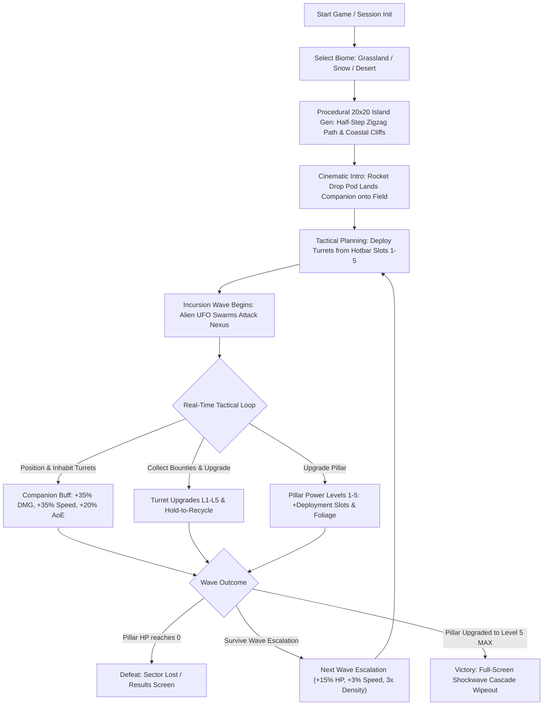
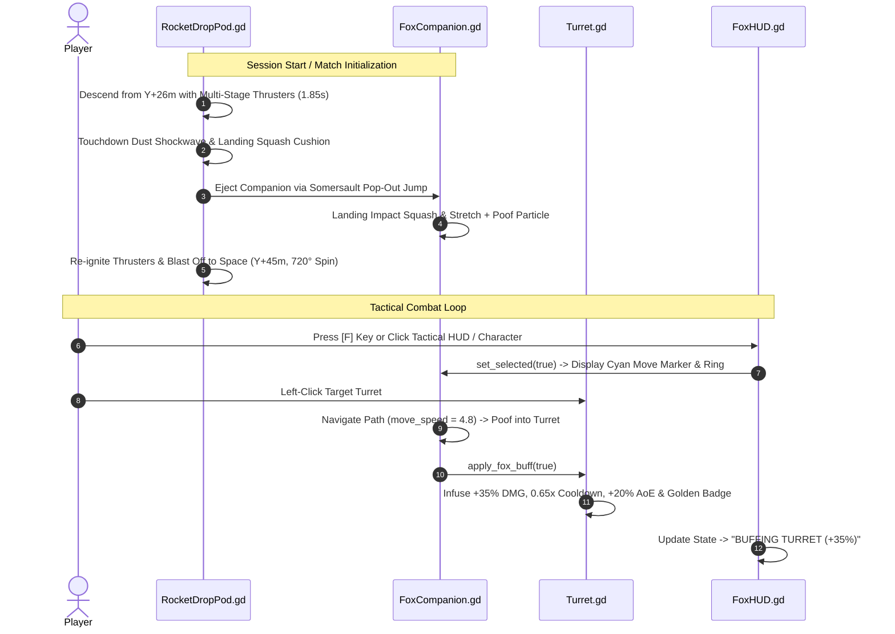
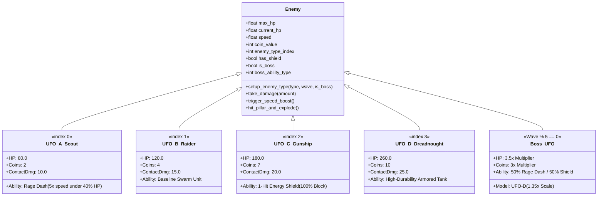
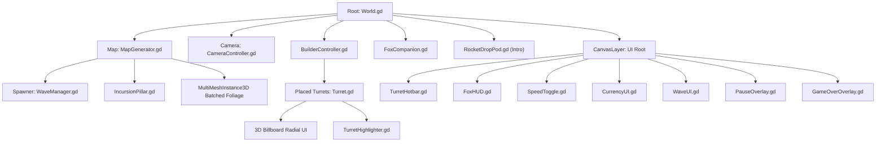
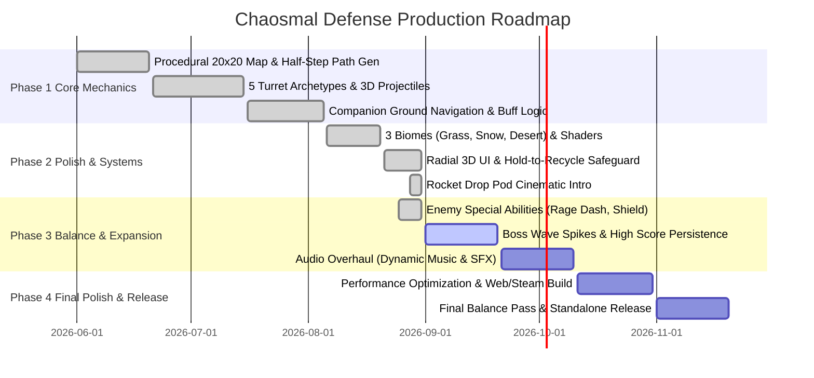

# Executive Summary — Chaosmal Defense

> **Document Type:** Game Design Document (GDD) — Developer-Focused Executive Summary & Design Bible  
> **Game Title:** Chaosmal Defense  
> **Engine & Version:** Godot Engine 4.x (Forward+ Vulkan Rendering, Physics Interpolation Enabled)  
> **Target Platform:** PC (Windows)  
> **Project Budget:** Rp 0 (Zero-Budget / Open-Source Godot 4 & CC0 Community Assets)  
> **Genre:** 3D Procedural Tower Defense / Real-Time Tactical Strategy  
> **Target Audience:** Strategy & Tower Defense enthusiasts, mid-core PC gamers, fans of tactical micromanagement and procedural progression (e.g., *Kingdom Rush*, *Bad North*, *Bloons TD 6*, *Defense Grid*).  
> **Document Status:** Active Reference & Production Baseline (Fully Synced with Codebase)  

---

## 1. High Concept & Elevator Pitch

**Chaosmal Defense** is a fast-paced, stylized 3D procedural tower defense game combining grid-based defensive fortification with real-time tactical companion micromanagement. Players defend the planetary sector's **Incursion Pillar** against relentless alien UFO swarms navigating procedurally generated zigzag routes across dynamic planetary biomes.

Unlike conventional static tower defense games, players deploy a **Biome-Specific Tactical Companion** (Fox, Lion, or Penguin) directly onto the battlefield via an explosive **Rocket Drop Pod** landing sequence. The player can actively command the companion in real time to navigate grid tiles or inhabit any front-line turret, infusing the weapon with **+35% Damage, +35% Attack Speed (0.65x Cooldown), and +20% AoE Radius**. Integrating 5 distinct turret archetypes, procedural island terrain generation, progressive vegetation restoration, adaptive enemy abilities (Rage Dash and 1-Hit Energy Shields), hold-to-recycle economic safeguards, and multi-stage boss encounters, *Chaosmal Defense* delivers high-stakes strategic depth in every session.



---

## 2. Core Game Pillars

1. **Active Tactical Leadership (The Tactical Companion Protocol):**  
   Strategy extends beyond pre-wave build orders. The player commands a physical ground hero (Fox in Grassland, Lion in Desert, Penguin in Snow) with tile pathfinding (`move_speed = 4.8`) and instant turret buffing, enabling real-time tactical triage at active chokepoints.
2. **Procedural Variety & Environmental Adaptation:**  
   No two battlefields are identical. Every match constructs a unique $20 \times 20$ island featuring guaranteed non-overlapping half-step zigzag routes, multi-mesh batched flora/rocks, coastal cliff extrusions down to ocean depth ($-5.0\text{m}$), and biome-tailored atmospheres (heat distortion, fog, lighting).
3. **Deep Archetypal Arsenal with Economic Agility:**  
   Five defensive weapon classes (Standard Rapid Kinetic Turret, Fast-Firing Cannon, Long-Range Piercing Ballista, Deadzone AoE Catapult, and 2x2 Heavy Turret) each feature 5 upgrade tiers with RPG rarity outlines (White $\rightarrow$ Green $\rightarrow$ Blue $\rightarrow$ Purple $\rightarrow$ Gold), a 60% sell refund rate, and a 0.5s Hold-to-Recycle safety mechanism on Level 5 turrets.
4. **Escalating Threat Profiles & Adaptive Enemy Mechanics:**  
   Invaders feature tiered stats and active tactical abilities: UFO-A (Rage Dash under 40% HP), UFO-C (1-Hit Energy Shield), UFO-D (Heavy Armor), and Boss UFOs (3.5x HP spike, 3x bounties, and randomized Rage or Shield mechanics every 5th wave).
5. **Living Nexus (The Incursion Pillar):**  
   The defensive core is an upgradable arcane crystal monolith. Upgrading the pillar from Level 1 to 5 increases turret deployment limits (+2, +4, +8 slots), accelerates island vegetation regrowth (+20%/lvl), drives crystal emission harmonics, and triggers a full-map enemy wipeout shockwave on reaching Level 5 MAX.

---

## 3. Core Gameplay Loop

```mermaid
flowchart LR
    subgraph G1["1. Economy & Fortification"]
        P1["Survey Procedural Path & Chokepoints"] --> P2["Spend Coins to Place 1x1 & 2x2 Turrets"]
        P2 --> P3["Manage Deployment Limit Base 8 + Pillar Bonuses"]
    end
    
    subgraph G2["2. Combat & Tactical Action"]
        C1["UFO Swarm Deploys from Spawner"] --> C2["Turrets Auto-Rotate & Fire Ballistics"]
        C2 --> C3["Select Companion 'F' & Inhabit Chokepoint Turret"]
        C3 --> C4["Destroy Invaders & Collect Scaled Bounties"]
    end
    
    subgraph G3["3. Progression & Endgame"]
        U1["Upgrade Turrets L1-L5 for Damage & Fire Rate"] --> U2["Upgrade Incursion Pillar L1-L5"]
        U2 --> U3["Survive Boss Waves 5, 10, 15..."]
        U3 --> U4["Level 5 Pillar Triggers Shockwave Victory"]
    end
    
    P3 --> C1
    C4 --> U1
    U4 --> P1
```



### Minute-to-Minute Player Flow
1. **Cinematic Landing & Survey:** The match opens with a Rocket Drop Pod landing the companion onto the terrain. The player surveys the generated half-step route, identifies corners and choke zones, and places initial turrets from the bottom hotbar.
2. **Engage & Counter:** Alien UFOs spawn with tiered speeds and abilities. Standard turrets handle baseline targets, rapid-fire cannons strip shields, ballistas snipe runners, and catapults wipe dense swarms.
3. **Tactical Micro:** The player presses `[F]` or clicks the companion to command it into high-threat turrets, providing immediate **+35% Damage, +35% Fire Rate, and +20% AoE Radius**.
4. **Economic Investment & Pillar Expansion:** Earn coin bounties from defeated enemies. Invest in single-turret upgrade branches or upgrade the Incursion Pillar to unlock additional turret deployment capacity (+2 at L2, +4 at L3, +8 at L4) and restore island flora.
5. **Boss Wave Siege & Victory:** Every 5th wave spawns a reinforced Boss UFO-D with 3.5x HP and randomized abilities. Reaching Pillar Level 5 unleashes an arcane shockwave that eradicates all active enemies and secures victory.

---

## 4. Systems & Mechanics Breakdown

### 4.1. Tactical Companion & Rocket Drop Pod System



- **Biome Companions:**
  - **Grassland:** Tactical Fox 🦊 (`animal-fox.glb`)
  - **Desert:** Tactical Lion 🦁 (`animal-lion.glb`)
  - **Snow / Alpine:** Tactical Penguin 🐧 (`animal-penguin.glb`)
- **Cinematic Rocket Drop Pod (`RocketDropPod.gd`):**
  - Multi-stage GPU particles: Fiery flame core (45 particles), smoke plume trail (35 particles), glowing sparks (25 particles), and dynamic flickering OmniLight3D (3.0–8.0 energy).
  - Parabolic somersault pop-out jump (`play_pop_out_jump`) with dust ring shockwave and cartoon squash-and-stretch.
- **Controls & HUD Integration (`FoxHUD.gd`):**
  - Quick-select toggle via `[F]` key, left tactical HUD widget, or clicking the companion/inhabited turret badge.
  - Dedicated 3D portrait headshot viewport rendered in real time.
  - Interactive status states: `READY ON FIELD` (Green), `COMMAND ACTIVE` (Yellow), and `BUFFING TURRET (+35%)` (Cyan).
- **Turret Buffing Specifications:**
  - **Damage:** $\text{Damage} \times 1.35$ (+35% increase).
  - **Cooldown:** $\text{Cooldown} \times 0.65$ (+35% effective attack speed boost).
  - **AoE Radius:** $\text{Radius} \times 1.20$ (+20% splash area expansion).
  - **Visuals:** Golden coin emblem badge (`_fox_buff_sprite`), pulsing outline flare, and gold move marker.

---

### 4.2. Defensive Arsenal & Turret Specifications

All turret balance parameters are configured in [`TurretHotbar.gd`](file:///d:/Game/IGI-Code-Circus/UI/Hotbar/TurretHotbar.gd) and executed in [`Turret.gd`](file:///d:/Game/IGI-Code-Circus/scripts/Turret.gd):

| Turret Archetype | Footprint | Base Cost | Base Dmg | Base Cooldown | Attack Range | Min Range | AoE Splash | Ammo Asset | Firing & Tactical Mechanics |
|:---|:---:|:---:|:---:|:---:|:---:|:---:|:---:|:---|:---|
| **Standard Turret** | 1x1 | 5 🪙 | 10.0 | 1.00s | 3.0 tiles | 0.0 | No | `weapon-ammo-bullet.glb` | Reliable kinetic baseline; rapid projectile speed (12.0) with linear recoil. |
| **Cannon** | 1x1 | 8 🪙 | 4.25 | 0.30s | 2.5 tiles | 0.0 | No | `weapon-ammo-cannonball.glb` | Rapid-fire suppression gun; shreds shields and weak runners with heavy barrel pushback. |
| **Ballista** | 1x1 | 15 🪙 | 18.75 | 1.60s | 5.5 tiles | 0.0 | No | `weapon-ammo-arrow.glb` | Long-range piercing sniper; eliminates targets from distance before they reach corners. |
| **Catapult** | 1x1 | 30 🪙 | 30.5 | 2.40s | 8.0 tiles | 4.0 tiles | Yes (2.0m) | `weapon-ammo-boulder.glb` | Artillery with minimum deadzone; mechanical arm wind-up/throw tween, parabolic arc flight, and AoE cluster wipe. |
| **Heavy Turret** | 2x2 | 50 🪙 | 40.0 | 2.80s | 4.0 tiles | 0.0 | No | `weapon-ammo-bullet.glb` (2x) | Massive single-target punch; high impact damage against armored UFO-D and Boss units. |

---

### 4.3. Turret Upgrades, Hold-to-Recycle & RPG Rarity Outlines

- **5-Tier Upgrade Progression:**
  - **Upgrade Cost Formula:**  
    $$\text{UpgradeCost}(\text{level}) = \max\left(\text{MinCost}[\text{lvl}], \text{round}(\text{BaseCost} \times \text{Multiplier}[\text{lvl}])\right)$$
    - Multipliers (L1 $\rightarrow$ L2, L2 $\rightarrow$ L3, L3 $\rightarrow$ L4, L4 $\rightarrow$ L5): `[1.5, 2.5, 4.0, 6.5]`
    - Minimum Cost Floors: `[2, 3, 5, 8]` 🪙
  - **Damage Scaling:** $\text{Damage}(\text{lvl}) = \text{BaseDmg} \times (1.0 + (\text{lvl} - 1) \times 0.30)$ (+30% damage per level).
  - **Range Scaling:** $1.0\times$ (L1–L2), $1.05\times$ (+5% at L3–L4), $1.10\times$ (+10% total at L5).
  - **AoE Radius Scaling:** $\text{AoE}(\text{lvl}) = \text{BaseAoE} \times (1.0 + (\text{lvl} - 1) \times 0.10)$ (+10% AoE radius per level).
  - **Fire Rate / Cooldown Scaling:** $\text{Cooldown}(\text{lvl}) = \frac{\text{BaseCooldown} \times (1.0 - (\text{lvl} - 1) \times 0.08)}{\text{SpeedMultiplier}}$ (8% cooldown reduction per level).

- **Selling & Hold-to-Recycle Safeguard:**
  - **Refund Equation:** $\text{Refund} = \max(1, \lfloor \text{TotalInvestedCoins} \times 0.60 \rfloor)$ (60% currency recovery).
  - **Instant Dismantle (Levels 1–4):** One-click refund with dismantle particle effect (`turret_dismantle_particle.tscn`) and grid cell freeing.
  - **Hold-to-Recycle Protection (Level 5 MAX):** Requires holding the sell button for **0.5 seconds**; displays a tactile press-in animation, circular shader progress ring, and 0.5s lockout on upgrade.

- **RPG Rarity Outlines (`TurretHighlighter.gd`):**
  - **Level 1 (Common):** White outline on hover / selection.
  - **Level 2 (Uncommon):** Persistent Emerald Green outline (`#33E059`, boil intensity 0.45, 8.0 FPS).
  - **Level 3 (Rare):** Persistent Azure Blue outline (`#26B3FF`, boil intensity 0.50, 8.0 FPS).
  - **Level 4 (Epic):** Persistent Royal Neon Purple outline (`#BF40FF`, boil intensity 0.55, 8.0 FPS).
  - **Level 5 (Legendary MAX):** Persistent Radiant Gold outline (`#FFCC1A`, boil intensity 0.65, 8.0 FPS).
  - **Upgrade Feedback:** Procedural squash-and-stretch spring bounce (`TRANS_ELASTIC`) and 3D particle celebration burst (`upgrade_celebration_particle.tscn`).

---

### 4.4. Incursion Pillar (Defensive Nexus & Victory System)

The **Incursion Pillar** ([`IncursionPillar.gd`](file:///d:/Game/IGI-Code-Circus/scripts/IncursionPillar.gd)) serves as the sector's central life-support nexus and primary progression engine:

- **Nexus Health & Defense:**
  - Base Health: **100.0 HP**.
  - Billboard 3D SubViewport health bar showing real-time `❤️ current / max` with dynamic color transitions (Green $>50\%$, Yellow $>25\%$, Red $\le 25\%$).
  - Shambles hit reaction: Decaying 6-stage model shake, emissive light damage flash, and debris burst particles (`pillar_hit_particle.tscn`).
- **5-Tier Monolith Upgrade Progression:**
  - **Upgrade Costs:** `[100, 250, 1000, 5000]` 🪙 for transitions L1 $\rightarrow$ L2, L2 $\rightarrow$ L3, L3 $\rightarrow$ L4, L4 $\rightarrow$ L5.
  - **Turret Deployment Bonuses:** Base limit of 8 slots is expanded by **+2 slots at L2**, **+4 slots at L3**, and **+8 slots at L4** on [`BuilderController.gd`](file:///d:/Game/IGI-Code-Circus/scripts/BuilderController.gd).
  - **Progressive Vegetation Restoration:** Each pillar upgrade reveals and restores +20% of the island's MultiMesh trees and grass blades.
  - **Visual & Harmonic Resonance:**
    - **L1 (Broken):** Erratic flickering crystal emission, spin speed 0.20 rad/s, Arcane Purple (`#B859FF`).
    - **L2 (Patching):** Gentle breathing emission, spin speed 0.65 rad/s, Arcane Purple.
    - **L3 (Bridging):** Spin speed 1.10 rad/s, dynamic Violet $\leftrightarrow$ Magenta hue drift.
    - **L4 (Harmonic):** Spin speed 1.50 rad/s, vibrant Electric Indigo $\leftrightarrow$ Radiant Fuchsia dual-tone wave.
    - **L5 (Celestial Resonance MAX):** Spin speed 2.00 rad/s, full Celestial Cyan $\leftrightarrow$ Arcane Violet $\leftrightarrow$ Plasma Magenta hue cycle.
- **Endgame Victory Condition (Level 5 MAX):**
  - Upgrading the Pillar to Level 5 triggers a fullscreen chromatic shockwave distortion (`PillarShockwave.tscn`).
  - Executes `wipe_all_active_enemies()`, obliterating all invading UFOs across the island in an expanding cascade.
  - Resets game speed to 1x and displays the Victory Summary modal with cleared wave stats and bounty totals.

---

## 5. Enemy Archetypes & Scaling Formulas



### 5.1. Mathematical Scaling Equations

Implemented in [`WaveManager.gd`](file:///d:/Game/IGI-Code-Circus/scripts/WaveManager.gd) and [`Enemy.gd`](file:///d:/Game/IGI-Code-Circus/scripts/Enemy.gd):

- **Enemy Health Scaling:**  
  $$\text{HP}(\text{wave}) = \text{BaseHP} \times \left(1.0 + (\text{wave} - 1) \times 0.15\right) \times (3.5 \text{ if Boss else } 1.0)$$
- **Coin Bounty Scaling:**  
  $$\text{Coins}(\text{wave}) = \left(\text{BaseCoins} + \left\lfloor \frac{\text{wave}}{3} \right\rfloor\right) \times (3 \text{ if Boss else } 1)$$
- **Movement Speed Scaling:**  
  $$\text{Speed}(\text{wave}) = 1.5 \times (1.0 + \text{wave} \times 0.03) \times \text{SpeedMultiplier} \times (\text{RageMult } [5.0] \text{ if active else } 1.0)$$
- **Wave Spawn Density (3x Multiplier, Capped at 120):**  
  $$\text{EnemiesToSpawn}(\text{wave}) = \min\left(120, \left(\text{randi}(4, 6) + \lfloor\text{wave} \times 1.5\rfloor + \text{randi}\left(0, \max(1, \lfloor\text{wave}/3\rfloor)\right)\right) \times 3\right)$$
- **Spawn Interval:** $\text{Interval} = \text{randf}(0.2, 1.5) \text{ seconds}$.
- **Inter-Wave Pause:** $\text{PauseDuration} = \max(3.0, 8.0 - \text{wave} \times 0.3) \text{ seconds}$.
- **Suicide Contact Damage on Incursion Pillar:**
  - UFO-A: **10.0 HP**
  - UFO-B: **15.0 HP**
  - UFO-C: **20.0 HP**
  - UFO-D / Boss: **25.0 HP**

### 5.2. Alien Enemy Roster & Tactical Behaviors

1. **UFO-A (Scout — `enemy-ufo-a.glb`):**
   - Base Stats: 80.0 HP, 2 Coins, 10.0 Contact Damage.
   - **Active Ability (Rage Dash):** When HP drops below 40%, triggers a sudden **5.0x speed boost for 0.8 seconds** with an orange outline (`#FF5919`) and scale pulse to rush past chokepoints.
2. **UFO-B (Raider — `enemy-ufo-b.glb`):**
   - Base Stats: 120.0 HP, 4 Coins, 15.0 Contact Damage.
   - **Tactical Role:** Steady mid-tier frontline unit; tests continuous DPS and cluster coverage.
3. **UFO-C (Gunship — `enemy-ufo-c.glb`):**
   - Base Stats: 180.0 HP, 7 Coins, 20.0 Contact Damage.
   - **Active Ability (1-Hit Energy Shield):** Spawns with an active energy barrier (Cyan outline `#33D9FF`) that **100% blocks the first incoming hit** regardless of damage magnitude. Counters slow single-shot weapons (Ballista/Heavy Turret), rewarding rapid-fire Cannons.
4. **UFO-D (Dreadnought — `enemy-ufo-d.glb`):**
   - Base Stats: 260.0 HP, 10 Coins, 25.0 Contact Damage.
   - **Tactical Role:** High-durability tank unit; requires focused heavy kinetic fire and companion-buffed turrets.
5. **Boss Incursions (Every 5th Wave — Waves 5, 10, 15, 20...):**
   - Guaranteed Boss spawn using scaled UFO-D model ($1.35\times$ scale).
   - Durability Spike: **$3.5\times$ Base HP** with **$3\times$ Coin Bounty**.
   - **Randomized Boss Ability:** 50% chance of **Speed Boost Rage Dash** (Gold outline `#FFD933`) OR **1-Hit Energy Shield** (Gold outline).

---

## 6. Procedural World Generation & Art Direction

### 6.1. Procedural Island Architecture

- **Grid Dimensions:** $20 \times 20$ grid units.
- **Half-Step Maze Algorithm:** Enemy routes generate on half-step coordinates ($2 \times 2$ cell spacing), mathematically ensuring a minimum 1-tile buildable gap between parallel paths.
- **Quarter Waypoint Checkpoints:** Route pathing alternates between top and bottom quadrants across the 4 map quarters, creating dynamic, winding mazes every run.
- **Coastal Cliffs & Ocean Depth:** Perlin noise modulates coastal border heights ($4\text{ tiles wide}$), extruding cliff geometry directly down to ocean floor depth ($-5.0\text{m}$) to eliminate visual voids.

```
+-------------------------------------------------------------+
|  [COASTAL CLIFFS & OCEAN DEPTH: -5.0m]                      |
|    +-----------------------------------------------------+  |
|    | (0,19)                             (19,19)          |  |
|    |      [SPAWNER] ---> S-Curve Half-Step Route         |  |
|    |                     |                               |  |
|    |                     v                               |  |
|    |          [Buildable 1x1 & 2x2 Grid Tiles]           |  |
|    |                     |                               |  |
|    |                     +---> [INCURSION PILLAR]        |  |
|    | (0,0)                              (19,0)           |  |
|    +-----------------------------------------------------+  |
|  [COASTAL CLIFFS & OCEAN DEPTH: -5.0m]                      |
+-------------------------------------------------------------+
```

### 6.2. Biome Ecosystems & Atmospheric Pipeline

1. **Lush Grassland (`biome_grass.tres`):** Vibrant green terrain, scattered oak/pine trees, rocks, procedural grass blades, swaying foliage shaders, and Tactical Fox 🦊 companion.
2. **Arid Desert (`biome_desert.tres`):** Golden dunes, desert cacti, palm trees (`tree_scale = 8.41`), full-screen heat distortion shader (`has_heat_distortion = true`, `disable_fog = true`), and Tactical Lion 🦁 companion.
3. **Alpine Snow (`biome_snow.tres`):** Frost terrain, snow pines, snow bushes, cool ambient lighting, custom snow particle shaders, and Tactical Penguin 🐧 companion.

### 6.3. Rendering & MultiMesh Batching Optimization
- **MultiMeshInstance3D Clustering:** Repeated environmental props (grass blades, rocks, trees, wall segments) are batched into single-drawcall MultiMeshes, ensuring 60+ FPS on PC hardware.
- **Custom Shader Suite:** Pixel-perfect outline shader (`outline_pixel_perfect.gdshader`), holographic ghost placement shader (`ghost_hologram.gdshader`), RPG rarity squiggle boil materials (`outline_material.tres`), chromatic shockwave distortion (`PillarShockwave.tscn`), and stylized UI materials.

---

## 7. User Interface & Controls Architecture

### 7.1. UI Layout Breakdown
- **Top Command Bar:** Currency Counter (🪙), Turret Deployment Cap Gauge (`current / max`), Game Speed Toggle (`1x` / `2x`), and Pause Menu trigger.
- **Bottom Turret Hotbar:** 5 slots displaying turret icons, keybind shortcuts (`[1]`–`[5]`), costs (5, 8, 15, 30, 50 🪙), and dynamic biome theme styles.
- **Left Tactical Companion HUD (`FoxHUD`):** 3D headshot portrait, status banner (`READY`, `COMMAND ACTIVE`, `BUFFING TURRET +35%`), action button (`Select` / `Cancel` / `Eject`), and command banner.
- **In-World 3D Billboard Radial UI:** Staggered pop-in radial interface displaying current level badge, upgrade button with cost, sell button with refund amount, and Level 5 hold-to-recycle progress bar.
- **Intro Briefing Overlay:** Visual novel dialogue interface with animated 3D companion viewport and typewriter text.

### 7.2. Input Mapping (PC / Windows)

| Action | Primary Input | Secondary / Alternative | Context / Functionality |
|:---|:---|:---|:---|
| **Camera Pan** | `[W]`, `[A]`, `[S]`, `[D]` | Arrow Keys | Smooth directional camera movement across the island. |
| **Camera Zoom** | Mouse Scroll Wheel | — | Zoom in / out within constrained distance bounds. |
| **Select Hotbar Slot** | `[1]` – `[5]` Keys | Left-Click Hotbar Slot | Select turret archetype for placement. |
| **Rotate Ghost Turret** | `[Spacebar]` | — | Rotates ghost blueprint by 90° increments before placement. |
| **Place Turret** | Left-Click (Valid Grid Tile) | — | Snaps and constructs turret; deducts coins and deployment slot. |
| **Cancel Placement / Deselect** | Right-Click | `[Escape]` | Cancels active blueprint or deselects current turret. |
| **Select Tactical Companion** | `[F]` Key | Left-Click Companion / HUD | Toggles companion command mode for movement or turret buffing. |
| **Issue Companion Command** | Left-Click Grid Tile / Turret | — | Directs companion to target tile or inhabits targeted turret. |
| **Toggle Game Speed** | `[1x] / [2x]` UI Button | — | Toggles simulation speed between 1x and 2x with synchronized timers. |
| **Pause Game** | `[Escape]` / Pause Button | — | Opens pause modal with Resume, Restart, and Main Menu options. |

---

## 8. Technical Specifications & Architecture

### 8.1. Engine & Runtime Configuration
- **Engine:** Godot Engine 4.x
- **Renderer:** Forward+ (Vulkan-based Desktop Renderer)
- **Physics Engine:** Godot Physics 3D with `physics_interpolation = true` for high-refresh display smoothness.
- **Window Display:** Canvas Items stretch mode with dynamic aspect ratio expansion.

### 8.2. Script & Node Hierarchy Architecture



### 8.3. Core Architecture Classes
- **[`MapGenerator.gd`](file:///d:/Game/IGI-Code-Circus/scripts/MapGenerator.gd):** Procedural half-step maze generation, biome resource resolver, MultiMesh batcher, and coastal terrain builder.
- **[`BuilderController.gd`](file:///d:/Game/IGI-Code-Circus/scripts/BuilderController.gd):** Grid snapping, ghost hologram projection, deployment tracking (base 8 + pillar upgrades), and screen-space raycasting.
- **[`Turret.gd`](file:///d:/Game/IGI-Code-Circus/scripts/Turret.gd):** Modular weapon base class managing target locking, projectile ballistics, procedural recoil/swing tweens, 3D radial UI, and hold-to-recycle logic.
- **[`FoxCompanion.gd`](file:///d:/Game/IGI-Code-Circus/scripts/FoxCompanion.gd):** Tactical hero controller handling tile pathfinding, squash-and-stretch breathing, poof transitions, and turret buffing (+35% DMG/Speed, +20% AoE).
- **[`RocketDropPod.gd`](file:///d:/Game/IGI-Code-Circus/scripts/RocketDropPod.gd):** Cinematic deployment pod with multi-stage thrusters, dynamic lighting, touchdown cushion, and blast-off takeoff.
- **[`WaveManager.gd`](file:///d:/Game/IGI-Code-Circus/scripts/WaveManager.gd):** Wave state machine, enemy count scaling (3x density, max 120), speed multiplier forwarding, and object pooling (120 nodes).
- **[`Enemy.gd`](file:///d:/Game/IGI-Code-Circus/scripts/Enemy.gd):** Invader controller managing waypoints, 3D health bars, Rage Dash (UFO-A / Boss), 1-Hit Shield (UFO-C / Boss), and suicide contact damage.
- **[`IncursionPillar.gd`](file:///d:/Game/IGI-Code-Circus/scripts/IncursionPillar.gd):** Central nexus health tracking, 5-tier monolith upgrades, deployment bonuses, vegetation growth, and victory shockwave triggering.

---

## 9. Production Status & Development Roadmap



---

## 10. Project Budget & Asset Licensing

### 10.1. Budget Breakdown
- **Total Development Budget:** **Rp 0** (Zero-Budget Indie Development)
- **Engine & Core Tools:** Godot Engine 4.x (Free, Open-Source under MIT License), Blender (FOSS), VS Code / Antigravity IDE.
- **Development Strategy:** 100% self-contained codebase leveraging custom procedural map algorithms, custom GLSL/Godot shaders, and public domain CC0 3D assets.

### 10.2. 3D Asset License & Attribution Matrix

| Asset Category | Asset Pack Name | Creator / Distributor | License Type | License Reference Path | Usage Terms |
|:---|:---|:---|:---|:---|:---|
| **Character & Animal Models** | Cube Pets (2.0) | Kenney (www.kenney.nl) | Creative Commons Zero (CC0 1.0 Universal) | [`assets/characters/License.txt`](file:///d:/Game/IGI-Code-Circus/assets/characters/License.txt) | Free for personal, educational, and commercial use. No royalties, credit optional. |
| **Tiles, Environment & Turrets** | Tower Defense Kit (2.1) | Kenney (www.kenney.nl) | Creative Commons Zero (CC0 1.0 Universal) | [`assets/License.txt`](file:///d:/Game/IGI-Code-Circus/assets/License.txt) | Free for personal, educational, and commercial use. No royalties, credit optional. |
| **Typography & Fonts** | VCR OSD Mono (1.001) | Riciery Leal | Freeware / Open Font | [`addons/Font/vcr_osd_mono/`](file:///d:/Game/IGI-Code-Circus/addons/Font/vcr_osd_mono/) | Permitted for game UI rendering and digital distribution. |

---

## 11. Summary & Sign-Off

*Chaosmal Defense* establishes a distinctive niche within the 3D tower defense genre on PC by pairing satisfying procedural level generation with an active, hands-on tactical companion system and deep economic customization. With a rock-solid codebase, zero-cost production pipeline, high-performance batched visuals, and precisely tuned scaling curves, the game represents a comprehensive, production-ready indie title.
